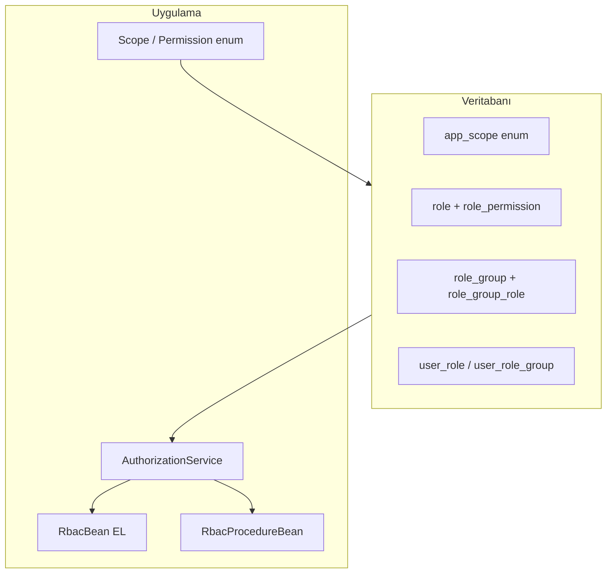

# RBAC: yetki modeli ve yeni scope / sayfa ekleme

Bu belge, Jakarta Muhasebe yönetim panelindeki rol tabanlı erişim kontrolünü (RBAC) ve **yeni bir iş kapsamı (scope)** veya **yeni admin sayfası** eklerken izlenmesi gereken sırayı özetler.

## Bağımlılık ve runtime

- **Derleme API:** [pom.xml](../pom.xml) içinde `jakarta.jakartaee-api` **11.0.0** (`provided`), **PrimeFaces** **14.0.8** (`jakarta` classifier). Gerçek sürümler uygulama sunucusunda (ör. Payara) gelir; dokümantasyon ile runtime uyumunu buradan takip edin.

## Veri modeli (PostgreSQL)

İlk şema: [src/main/resources/db/migration/V1__initial_schema.sql](../src/main/resources/db/migration/V1__initial_schema.sql).

| Kavram | Tablo / tip | Açıklama |
|--------|----------------|----------|
| Kapsam | `app_scope` (enum), `role.scope` | Örn. `USER`, `ROLE`, `ROLE_GROUP` |
| İzin | `app_permission` (enum), `role_permission.permission` | Örn. `READ`, `UPDATE`, `ACCESS` |
| Rol | `role` | `name` + `scope`; soft-delete `deleted_at` |
| Grup | `role_group` | Süper admin gibi toplu atamalar |
| Grup–rol | `role_group_role` | Gruba bağlı roller |
| Kullanıcı–rol | `user_role` | Doğrudan rol ataması |
| Kullanıcı–grup | `user_role_group` | Rol grubu ataması |

**Önemli:** Yetki “hesaplaması” etkin kullanıcı rollerinin birleşimiyle yapılır ([AuthorizationService](../src/main/java/service/AuthorizationService.java) vb.). Yeni bir `scope` için veritabanında **o scope’ta roller ve izinleri** yoksa, arayüzde `rbac.can('YENİ_SCOPE', …)` her zaman false döner.

## Java enum’ları

- [enums/Scope.java](../src/main/java/enums/Scope.java) — iş alanı kapsamları.
- [enums/Permission.java](../src/main/java/enums/Permission.java) — eylem türleri (`CREATE`, `READ`, `ACCESS`, …).

Yeni bir modül için tipik olarak **önce** `Scope` enum’una sabit eklenir; ardından veritabanı ve seed adımları gelir.

## PostgreSQL’de yeni `app_scope` değeri

`role.scope` sütunu PostgreSQL `app_scope` enum’una bağlıdır. Sadece Java tarafını güncellemek **yetmez**.

1. Yeni bir Flyway migration dosyası ekleyin (ör. `V4__scope_xxx.sql`).
2. Enum genişletme: `ALTER TYPE app_scope ADD VALUE 'YENI_SCOPE';` (sürüm ve isimlendirme proje standardına göre).
3. Gerekirse yeni roller / seed bu migration’da veya takip eden migration’da tanımlanır.

**Native sorgu notu:** [RoleFacade](../src/main/java/facade/RoleFacade.java) içinde `listByScope` gibi metotlarda scope, `CAST(?1 AS app_scope)` ile bağlanır; EclipseLink + PostgreSQL enum uyumu bu desene dayanır. JPQL’de `WHERE r.scope = :scope` ile parametre bağlarken tip uyumsuzluğu yaşanmaması için bu facade’deki yaklaşımı referans alın.

## Seed ve süper admin grubu

Örnek tohum: [V3__super_admin_rbac_seed.sql](../src/main/resources/db/migration/V3__super_admin_rbac_seed.sql).

Mantık özeti:

- `super_admin` adlı bir `role_group` oluşturulur.
- Her `app_scope` × her `app_permission` için bir `role` kaydı üretilir; `role_permission` ile izin atanır; `role_group_role` ile gruba eklenir.
- Admin kullanıcıya `user_role_group` ile bu grup atanır.

**Yeni scope eklediğinizde:** Aynı döngüyü yeni scope için de çalıştıran bir migration (veya mevcut seed’i genişleten script) yazın; aksi halde yeni scope’ta hiç rol oluşmaz ve RBAC çalışmaz.

## Yetki kontrolünün iki katmanı

### 1) Arayüz (Facelets)

[bean/RbacBean.java](../src/main/java/bean/RbacBean.java) — EL: `#{rbac.can('USER','ACCESS')}`.

- Menü ve butonlarda `rendered="#{rbac.can('SCOPE','PERMISSION')}"` kullanın.
- Bu yalnızca **UX** içindir; güvenlik asıl sunucuda sağlanmalıdır.

### 2) Sunucu (EJB / bean aksiyonları)

[procedure/RbacProcedureBean.java](../src/main/java/procedure/RbacProcedureBean.java) — `require(Scope scope, Permission permission)`.

Örnek kullanım: [bean/AdminUsersBean.java](../src/main/java/bean/AdminUsersBean.java) içinde `refresh()`, `openEdit`, `save`, `softDelete` öncesi `rbacProcedure.require(Scope.USER, Permission.…)`.

- Her mutasyon ve hassas okuma için bean metodunun girişinde `require` çağrısı yapın.
- Facade katmanında isteğe bağlı ek kontroller; asgari çizgi **bean + procedure**.

## Yeni admin sayfası checklist

1. **Scope / izin:** Gerekirse `Scope` ve DB `app_scope` + seed (yukarıdaki sıra).
2. **Sayfa:** `src/main/webapp/admin/<sayfa>.xhtml`, `ui:composition` ile [WEB-INF/templates/admin.xhtml](../src/main/webapp/WEB-INF/templates/admin.xhtml).
3. **Bean:** `@Named` + `@ViewScoped` (veya proje standardı); `@PostConstruct` ve her public aksiyonda `RbacProcedureBean.require`.
4. **Menü:** [WEB-INF/includes/admin-sidebar.xhtml](../src/main/webapp/WEB-INF/includes/admin-sidebar.xhtml) içinde uygun `details` grubuna `h:link` + `rendered="#{rbac.can('…','ACCESS')}"` (veya ihtiyaca göre `READ`).
5. **EJB:** İş kuralları için facade; [AbstractFacade](../src/main/java/facade/AbstractFacade.java) yalnızca ortak `EntityManager` taşır — yeni facade sınıfları `@Stateless` ile somut sınıfta tanımlanmalıdır (soyut sınıfta gereksiz `@Stateless` kaydı oluşturmayın; ileride refactor edilebilir).

## Kenar çubuğu menü grupları

- Şablon: [admin-sidebar.xhtml](../src/main/webapp/WEB-INF/includes/admin-sidebar.xhtml).
- “Sistem yönetimi” ve “Muhasebe işlemleri” bölümleri HTML `
` / `
` ile açılıp kapanır; stiller [admin-shell.css](../src/main/webapp/resources/css/admin-shell.css) içinde `.admin-sb-details*` sınıflarıyla verilir.
- Muhasebe altına yeni link eklerken aynı RBAC `rendered` kalıbını kullanın.

## Log: PrimeIcons mime (JSF1091)

`web.xml` içinde `.woff2`, `.woff`, `.ttf`, `.eot` için `mime-mapping` tanımlanmıştır; PrimeFaces ikon fontları yüklenirken “No mime type found” uyarılarını azaltır.

## Özet akış

Yeni geliştirici için kısa kural: **enum ve DB enum’u → seed rolleri → menü + bean `require` + (isteğe bağlı) facade** sırasını atlama; UI’daki `rbac.can` tek başına yeterli değildir.
