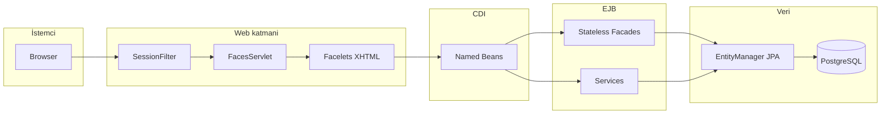

# Jakarta Muhasebe — Teknik Dokümantasyon

Bu klasör, `accounting` WAR projesinin (`pom.xml`: Jakarta EE 11, JSF/Facelets, PrimeFaces, JPA EclipseLink, EJB) kaynak yapısını ve çalışma biçimini Türkçe olarak özetler.

## Okuma sırası

1. [Mimari ve istek akışı](mimari-ve-istek-akisi.md) — `web.xml`, oturum filtresi, Faces lifecycle özeti.
2. [Webapp klasör yapısı](webapp-klasor-yapisi.md) — `src/main/webapp` ağacı, şablonlar, sayfalar, statik kaynaklar.
3. [Ön yüz bileşenleri](on-yuz-bilesenleri.md) — Facelets/PrimeFaces, RBAC EL kalıpları.
4. [Sayfa–bean–facade eşlemesi](sayfa-bean-facade-eslemesi.md) — hangi XHTML hangi CDI bean ve EJB’lere bağlı.
5. [Backend — Entity](backend-entity.md) — JPA varlıkları ve tablolar.
6. [Backend — Facade](backend-facade.md) — `facade/*` ve `facadeLocal/*`, `AbstractFacade`.
7. [Backend — Servis ve güvenlik](backend-service-ve-guvenlik.md) — Yetkilendirme, denetim, `RbacProcedureBean`.
8. [Backend — Beans](backend-beans.md) — `@Named` yönetim bean’leri ve ana metodlar.
9. [Backend — Diğer](backend-diger.md) — Converter, filter, bootstrap, util.
10. [Veritabanı migration](veritabani-migration.md) — Flyway dosyalarının sırası ve özeti.

## Tek paragraf mimari özet

Tarayıcı isteği önce [`SessionFilter`](../main/java/filter/SessionFilter.java) ile korunan yollarda oturum kontrolünden geçer; JSF `FacesServlet` `*.xhtml` görünümlerini işler. Facelets şablonları (`WEB-INF/templates/admin.xhtml` vb.) içerik bölgelerini doldurur; EL ifadeleri (`#{...}`) CDI bean’lerine bağlanır. Bean’ler iş kuralları için `@EJB` ile stateless facade’leri çağırır; facade’ler `EntityManager` (`testPU`) üzerinden kalıcılık sağlar. RBAC, `EffectiveRoleResolver` + `AuthorizationService` ile rol/rol grubu birleşimi ve `role_permission` sorgusuyla doğrulanır; arayüzde `#{rbac.can('SCOPE','PERMIT')}` kullanılır.

## Kaynak dizinleri (kısa referans)

| Dizin | Rol |
|-------|-----|
| [`src/main/webapp`](../main/webapp) | JSF görünümleri, `WEB-INF`, `resources` |
| [`src/main/java`](../main/java) | Entity, facade, bean, service, filter, converter |
| [`src/main/resources/META-INF`](../main/resources/META-INF) | `persistence.xml`, `beans.xml` |
| [`src/main/resources/db/migration`](../main/resources/db/migration) | Flyway SQL |

Üçüncü parti minify edilmiş Bootstrap dosyaları bu dokümanda satır satır açıklanmaz; konum ve rol özetlenir ([webapp-klasor-yapisi.md](webapp-klasor-yapisi.md)).
