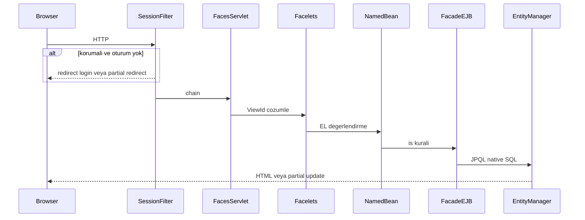

# Mimari ve istek akışı

## Teknoloji yığını

| Bileşen | Dosya / yapılandırma |
|---------|----------------------|
| Jakarta Servlet / JSF | [`src/main/webapp/WEB-INF/web.xml`](../main/webapp/WEB-INF/web.xml) |
| PrimeFaces | Bağımlılık `pom.xml`; tema `primefaces.THEME` = `saga` |
| CDI | [`beans.xml`](../main/resources/META-INF/beans.xml) (implizit tarama) |
| JPA | [`persistence.xml`](../main/resources/META-INF/persistence.xml), birim `testPU`, EclipseLink |
| EJB | `@Stateless` facade ve service sınıfları |

## web.xml özeti

[`web.xml`](../main/webapp/WEB-INF/web.xml) başlıca şunları yapılandırır:

- **Faces Servlet**: `jakarta.faces.webapp.FacesServlet`, eşleme `*.xhtml`.
- **PrimeFaces tema**: context-param `primefaces.THEME` → `saga`.
- **Proje aşaması**: `jakarta.faces.PROJECT_STAGE` → `Development`.
- **Uzantısız URL**: `jakarta.faces.AUTOMATIC_EXTENSIONLESS_MAPPING` → `true` (ör. `/admin/dashboard` → `dashboard.xhtml`).
- **Durum saklama**: `jakarta.faces.STATE_SAVING_METHOD` → `client`; `SERIALIZE_SERVER_STATE` → `true`.
- **Oturum**: 30 dakika; çerez `http-only` (üretimde `secure` uyarısı: şu an `false`).
- **Karşılama dosyası**: `index.xhtml`.
- **Font MIME**: `woff2`, `woff`, `ttf`, `eot` (PrimeIcons uyumu).

## SessionFilter

[`SessionFilter`](../main/java/filter/SessionFilter.java) `@WebFilter` ile şu desenlere uygulanır: `/panel/*`, `/app/*`, `/admin/*`, `/login`, `/login.xhtml`, `/register`, `/register.xhtml`.

Davranış:

1. Oturumda `user` veya `userId` varsa “giriş yapılmış” kabul edilir.
2. **Login / register** URL’leri: zaten girişliyse `admin/dashboard.xhtml`’e yönlendirme.
3. **Diğer korumalı yollar**: giriş yoksa normal istekte `login.xhtml`’e redirect; JSF AJAX (`Faces-Request: partial/ajax`) ise partial-response XML ile istemci tarafı redirect.

## İstek sırası (özet)

## Kalıcılık birimi

[`persistence.xml`](../main/resources/META-INF/persistence.xml): `testPU`, `transaction-type="JTA"`, `jta-data-source` `jdbc/testPSQL` (uygulama sunucusunda tanımlı JNDI veri kaynağı beklenir).

## Bootstrap singleton

[`SeedAdminSuperAdminBootstrap`](../main/java/bootstrap/SeedAdminSuperAdminBootstrap.java) ortam değişkeni `SEED_ADMIN_ENSURE_SUPER_ADMIN` açıksa seed admin kullanıcıya süper admin rol grubu atamasını garanti eder (detay: [backend-diger.md](backend-diger.md)).
